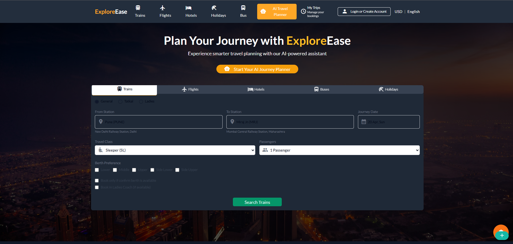

# ExploreEase 🌍 – AI-Powered Travel Planner
ExploreEase is an intelligent travel planning platform that leverages artificial intelligence to craft personalized itineraries, recommend hidden gems, and optimize your travel budget—all in one place. Whether you're a solo adventurer or planning a family getaway, ExploreEase transforms trip planning into an effortless and enjoyable experience.

## 🚀 Features

- **Personalized Itineraries**: AI-generated travel plans tailored to your preferences, budget, and schedule.
- **Dynamic Map Interface**: Visualize and modify your travel routes with an intuitive drag-and-drop map.
- **Real-Time Updates**: Stay informed with live weather forecasts, event listings, and transportation schedules.
- **Smart Budgeting**: Allocate daily spending, track expenses, and discover exclusive deals on accommodations and flights.
- **AI Chatbot Assistant**: Interact with our AI-powered chatbot for instant travel assistance and recommendations.
- **User Account Management**: Register and log in securely to save and manage your travel plans.

## 🛠️ Tech Stack

- **Frontend**: React.js, TypeScript, Tailwind CSS
- **Backend**: Node.js, Express.js
- **Database**: MySQL
- **AI Integration**: OpenRouter API, Gemini API
- **Third-Party APIs**: Goibibo API for real-time flight and hotel data
- **Authentication**: JWT-based secure authentication system

## 📦 Installation

### Prerequisites

- Node.js (v14 or later)
- npm or yarn
- MySQL

### Steps

1. **Clone the repository**:

   ```bash
   git clone https://github.com/yourusername/ExploreEase.git
   ```

2. **Navigate to the project directory**:

   ```bash
   cd ExploreEase
   ```

3. **Install frontend dependencies**:

   ```bash
   cd client
   npm install
   ```

4. **Install backend dependencies**:

   ```bash
   cd ../server
   npm install
   ```

5. **Configure environment variables**:

   Create a `.env` file in the `server` directory and add your configuration settings.

6. **Set up the MySQL database**:

   Ensure MySQL is running and execute the provided SQL scripts to set up the database schema.

7. **Start the development servers**:

   - **Backend**:

     ```bash
     cd server
     npm run dev
     ```

   - **Frontend**:

     ```bash
     cd client
     npm run dev
     ```

8. **Access the application**:

   Open your browser and navigate to `http://localhost:3000` to use ExploreEase.

## 📸 Screenshots



## 🤝 Contributing

We welcome contributions from the community!

To contribute:

1. Fork the repository.
2. Create a new branch: `git checkout -b feature/YourFeatureName`.
3. Commit your changes: `git commit -m 'Add your feature'`.
4. Push to the branch: `git push origin feature/YourFeatureName`.
5. Open a pull request.

Please ensure your code adheres to our coding standards and includes appropriate tests.

## 📄 License

This project is licensed under the MIT License. See the [LICENSE](LICENSE) file for details.

## 👥 Team

- **Bhanuteja** – Project Lead , AI Integration & frontend Development
- **Santhosh** – Backend Development & System Architecture
- **Shubham** – Frontend Development & UI/UX Design
- **Yashika** – Data Collection & User Experience

## 🔗 Connect with Me
- **LinkedIn:** [Santhosh VS](https://www.linkedin.com/in/thesanthoshvs/)
- **GitHub:** [Itssanthoshhere](https://github.com/Itssanthoshhere)

---

*Start your journey with ExploreEase today and unlock a world of travel possibilities!*

---
